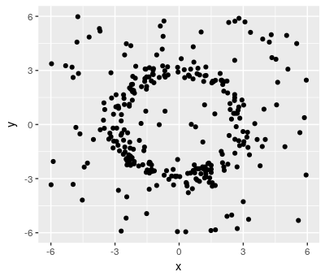
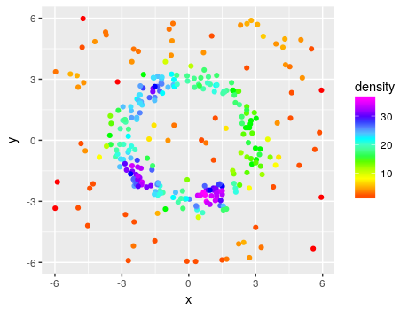
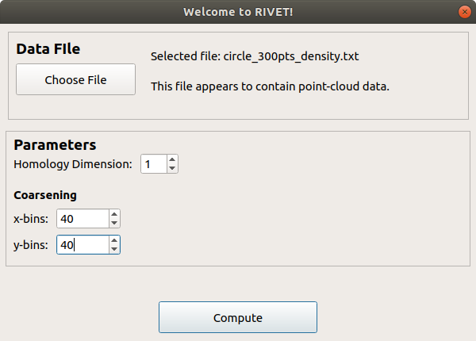
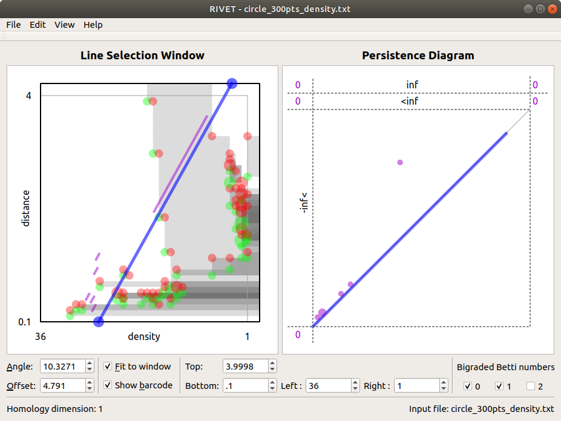
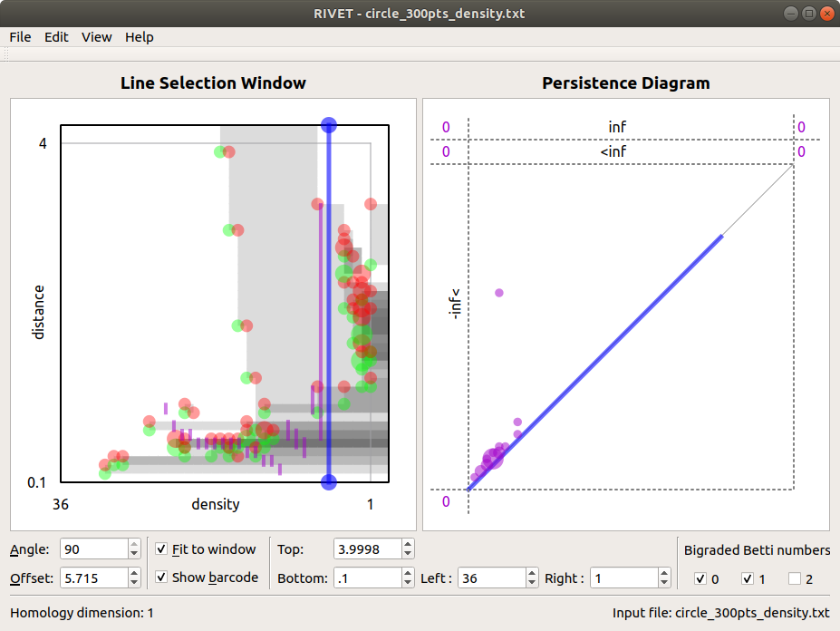

Example
=====================================

This page demonstrates how to use RIVET to visualize the topological structure of a point cloud.  We consider the point cloud in :math:`\mathbb{R}^2` pictured below.  We emphasize, however, that RIVET can handle point clouds in any dimension, as well as other data types.

Evidently, this point cloud contains a dense circle of points, as if many of the points were sampled from an annulus. 
However, we also observe outliers, both inside and outside of the annulus.
Note that one-parameter persistence (e.g., using a Rips filtration) cannot easily detect the dense cycle, due to the presence of outliers.

We will associate to this data a function-Rips bifiltration, taking the function on the points to be a density estimate; here, we use a simple ball density estimator, which for each point :math:`p` simply counts the number of points within a unit distance of :math:`p`.  The following diagram colors the points by density.

Input File
^^^^^^^^^^^^^^^^^^^^^^^^^^^^^^^^^^^^^^

We next prepare an input file for RIVET.  This is a text file written in the format described on the :ref:`inputData` page.
The first lines of the text file appear below (`the complete file is in the RIVET repository <https://github.com/rivetTDA/rivet/blob/master/data/Test_Point_Clouds/circle_300pts_density.txt>`_)::

	points
	2
	4
	[-] density
	1.57	2.40	20
	1.21	2.70	22
	0.79	-2.44	32
	...

The first four lines are parameters for RIVET: ``points`` tells RIVET that the file contains point-cloud data, ``2`` indicates that each point is specified by two coordinates, ``4`` specifies that the maximum length of edges to be constructed in the Rips filtration will be 4, and ``density`` is a text label for the horizontal axis in RIVET. 
The ``[-]`` preceding the axis label tells RIVET to filter by density in    decreasing order, so that points with the largest density appear first in the bifiltration.

Computation from the GUI
^^^^^^^^^^^^^^^^^^^^^^^^^^^^^^^^^^^^^^

We proceed using the the RIVET GUI.
With RIVET installed, we run ``rivet_GUI``.  The input data dialog box appears.  We select the data file and computation parameters, as shown below.
Since we are interested in detecting a cycle, we select homology dimension 1.
We must also set parameters for the coarseness of the computation, via the *bins* selectors.  These tell RIVET to round the computed values for density and distance to a specified number of equally-spaced values, which speeds up the computation.
We will choose 40 bins in each direction.

(Note that setting the bin selectors to *zero* will cause RIVET not to round the computed values, is more computationally expensive.)

We click **Compute**, and RIVET computes the augmented arrangement. 
This may take several minutes, depending on the computing power available.

Visualization
^^^^^^^^^^^^^^^^^^^^^^^^^^^^^^^^^^^^^^

When the Hilbert function and bigraded Betti numbers have been computed, visualizations of these appear in the *Line Selection Window* on the left side of the RIVET window (see the :ref:`visualization` page for more details).
When the computation of the augmented arrangement is complete, a barcode appears in the *Line Selection Window* and a persistence diagram appears in the *Persistence Diagram* window in RIVET, as shown below.
RIVET is now ready for interactive browsing of barcodes along linear slices through the bipersistence persistence module.

For this data, note that the barcode contains a single long bar when the selected line goes roughly from the lower-left corner to the upper-right corner of the Line Selection Window.  This bar corresponds to the dense cycle of points in the point cloud.

Furthermore, note that selecting vertical lines effectively thresholds the points by density.
That is, selecting a vertical line with density value :math:`d` produces a barcode computed from a Rips filtration on only those points with density value greater than :math:`d`, as shown below.
This effectively reduces the analysis to one-parameter persistence, using a density threshold.
The RIVET GUI allows the user to slide the vertical line left and right, thereby displaying the barcodes for different choices of the density threshold.

Computation from the Console
^^^^^^^^^^^^^^^^^^^^^^^^^^^^^^^^^^^^^^

Rather than using the RIVET GUI, one may use the RIVET console application to compute the augmented arrangement and even obtain barcodes.
This is done using the command line, as described in :ref:`runningRIVET`.
For example, the computation described above can be obtained from **rivet_console** using the following command, run from the root directory of the RIVET repository::

	./rivet_GUI/data/Test_Point_Clouds/circle_300pts_density.txt circle_300_computed.mif -H 1 -X 40 -y 40

This will produce a module invariants file ``circle_300_computed.mif``, which may then be loaded into the RIVET GUI or queried for barcodes on a collection of user-chosen lines.
Please see :ref:`runningRIVET` for more details.

