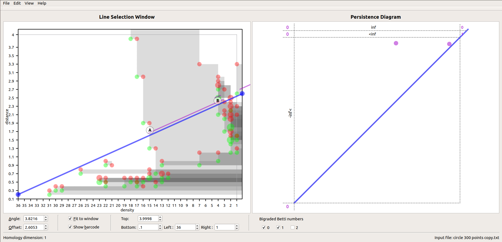
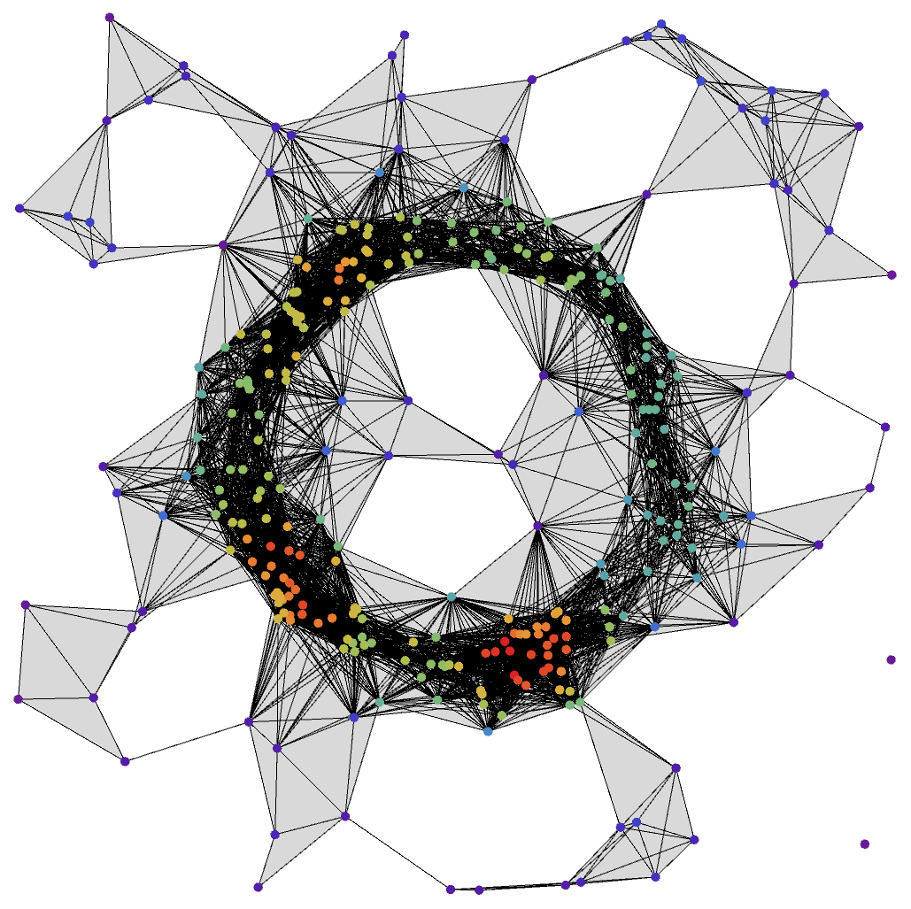

Understanding the Visualization
=====================================

To understand the RIVET visualization, we will examine the simplicial complexes corresponding to specific parameter pairs identified in the RIVET diagram.

Visualizing Persistence
------------------------------------------
We have already noted that the long bar in the RIVET visualization corresponds to the dense cycle of points in the point cloud. We will now examine simplicial complexes corresponding to parameter pairs near either end of the long bar, indicated by labels Ⓐ and Ⓑ in the diagram below.

Point Ⓐ has the density value of 15 and the distance value of 1.5. Thus, we construct a Rips complex at distance scale 1.5, from of only the points with density value 15 or greater, shown in the following diagram. As expected, the simplicial complex shows a single hole.

.. image:: images/example_1/15_1.5_1_hole.png
   :width: 400px
   :height: 340px
   :alt: simplicial complex corresponding to point A
   :align: center

Similarly, point Ⓑ has density value 7 and distance value 2.3; the corresponding Rips complex is shown in the following diagram. The single large hole is still present, though many more simplices appear around the hole.   
   
 .. image:: images/example_1/7_2.3_1_hole.png
   :width: 400px
   :height: 340px
   :alt: simplicial complex corresponding to point B
   :align: center
   

Large Hilbert function value
-------------------------------------

In the following RIVET visualization, point Ⓒ is located in a region where RIVET reports the homology dimension of 8. (In RIVET, hover the mouse over a grey rectangle to see the reported dimension.) 

.. image:: images/example_1/large hilbert value.png
   :width: 400px
   :height: 340px
   :alt: Rivet visualization with point C labeled
   :align: center

Point Ⓒ has density 0 and distance parameter 1.8. Thus, the corresponding simplicial complex will be the Rips complex with distance scale 1.8 constructed from _all_ of the data points. The simplicial complex is shown below; note that it has eight holes, as expected.

 

Investigating four more points
----------------------------------------

The following RIVET visualization indicates four points, labeled Ⓓ, Ⓔ, Ⓕ, and Ⓖ.

.. image:: images/example_1/4 other points.png
   :width: 400px
   :height: 340px
   :alt: Rivet Visualization with points D, E, F, and G labeled
   :align: center

Point Ⓓ has a density 18 and a distance 0.53, and is located in a region of homology dimension 4. Constructing a Rips complex at distance scale 0.53 from only the points with density value 18 or more, we obtain the following diagram. The simplicial complex shows four holes, as expected.

.. image:: images/example_1/18_0.53_4_holes.png
   :width: 400px
   :height: 340px
   :alt: simplicial complex corresponding to point D
   :align: center

Point Ⓔ has density 5 and a distance 1.0, and also lies in a region of homology dimension 2. The corresponding simplicial complex, illustrated below, again shows two holes. Note that these are different holes from those in the simplicial complex corresponding to point Ⓓ, since homology present at Ⓓ does not persist to point Ⓔ.

.. image:: images/example_1/5_1.0_2_holes.png
   :width: 400px
   :height: 340px
   :alt: simplicial complex corresponding to point E
   :align: center

Point Ⓕ has density 10 and distance 0.4, and lies in a region of homology dimension 3. The corresponding simplicial complex, illustrated below, shows three holes.

.. image:: images/example_1/10_0.4_3_holes.png
   :width: 400px
   :height: 340px
   :alt:  simplicial complex corresponding to point F
   :align: center
   
Lastly, Point Ⓖ has density 25 and distance 2.5, and lies in a region of homology dimension 0. As you can see in the diagram, there are no gray rectangles behind the point Ⓖ labeled, therefore we would expect no holes. The corresponding simplicial complex, displayed below, shows what we expected with no holes shown.

.. image:: images/example_1/25_2.5_no_holes.png
   :width: 400px
   :height: 340px
   :alt:  simplicial complex corresponding to point G
   :align: center

