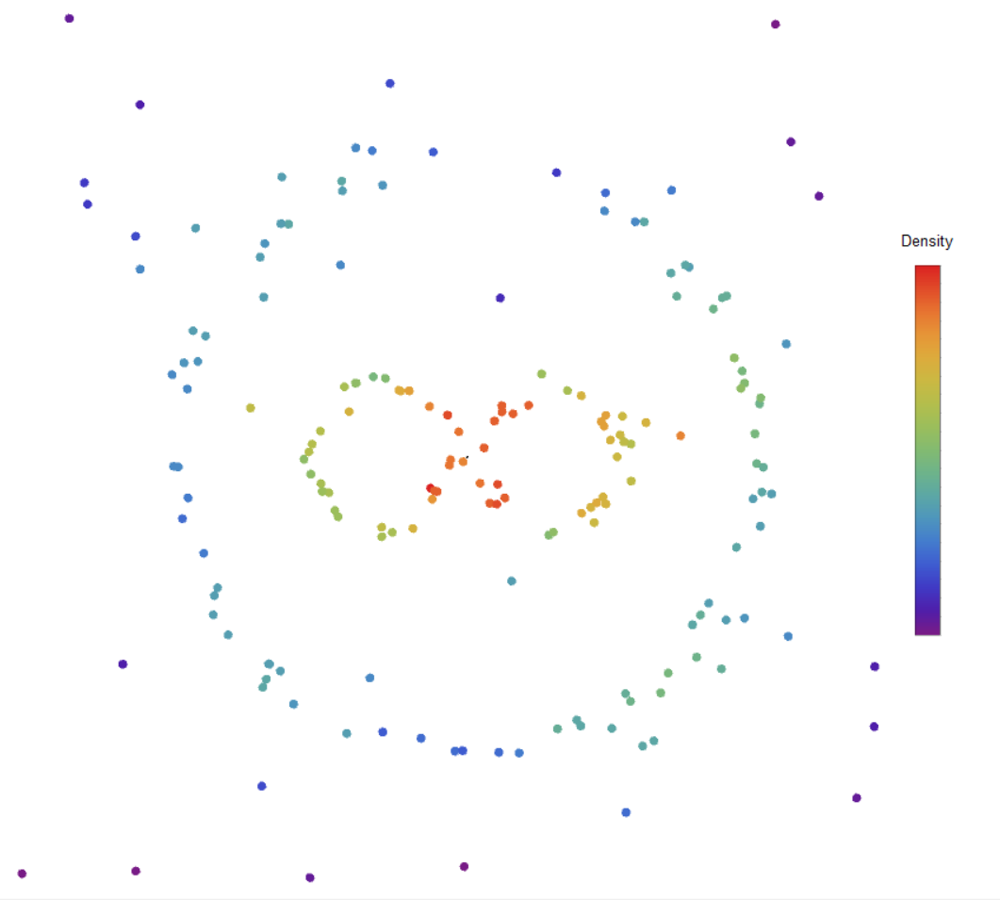
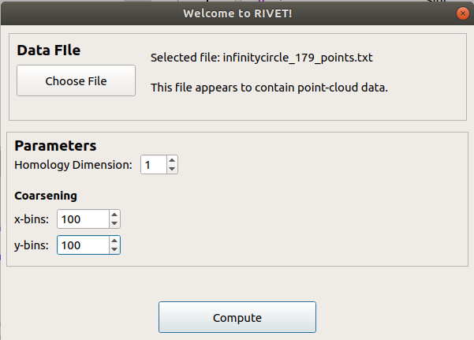
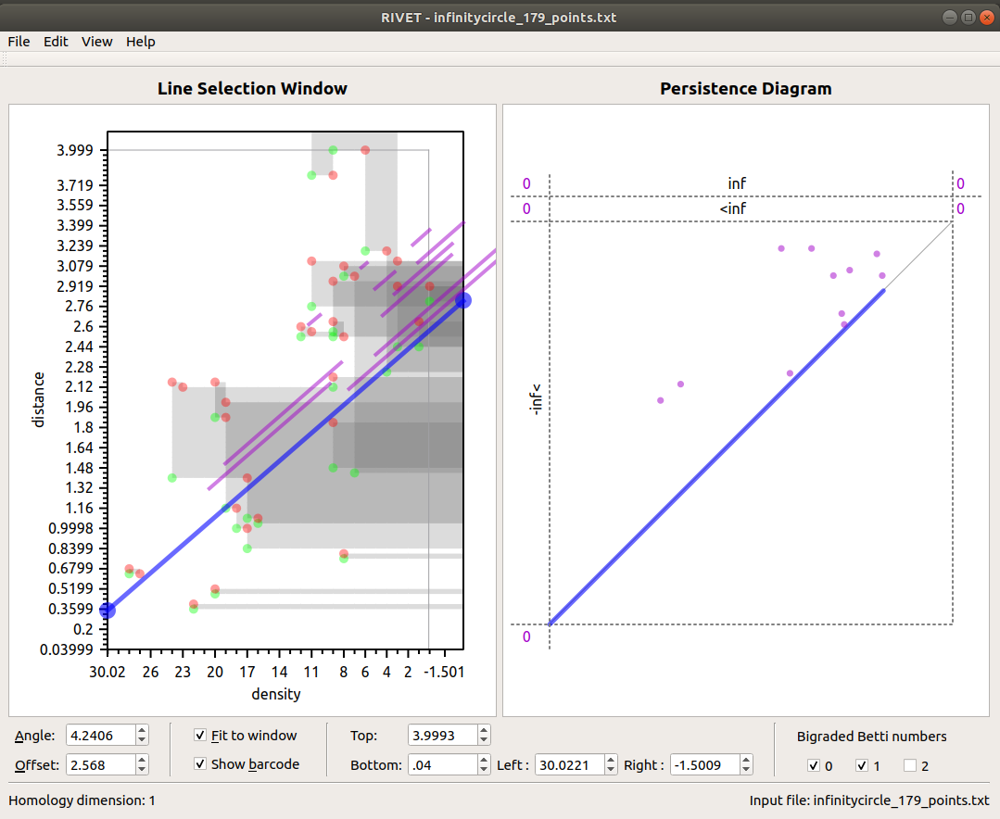
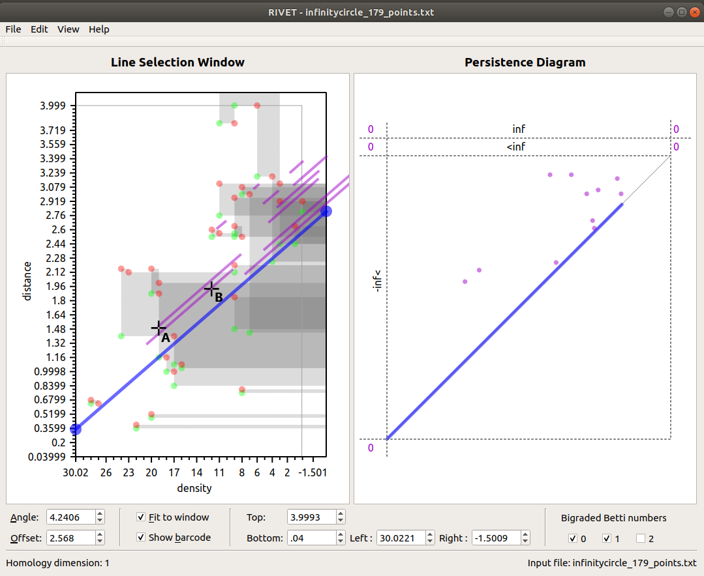
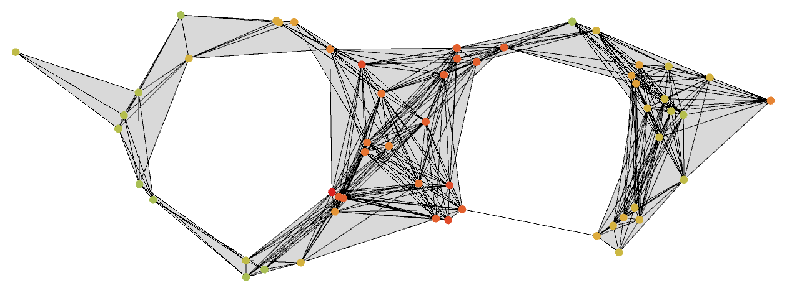
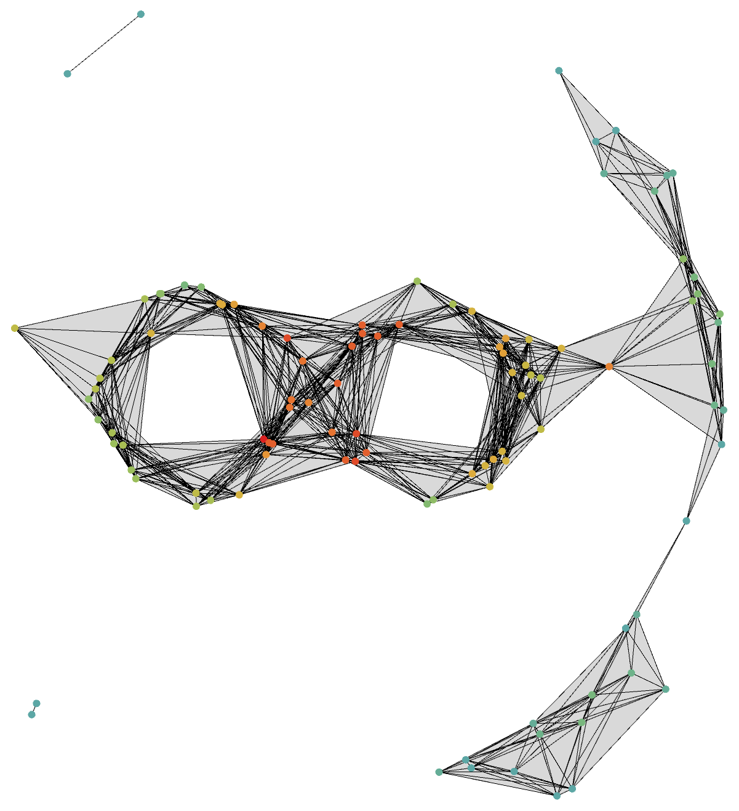
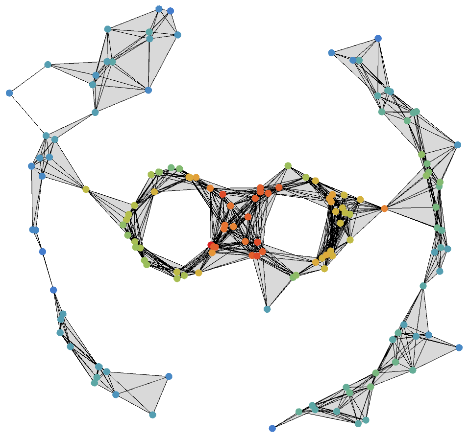
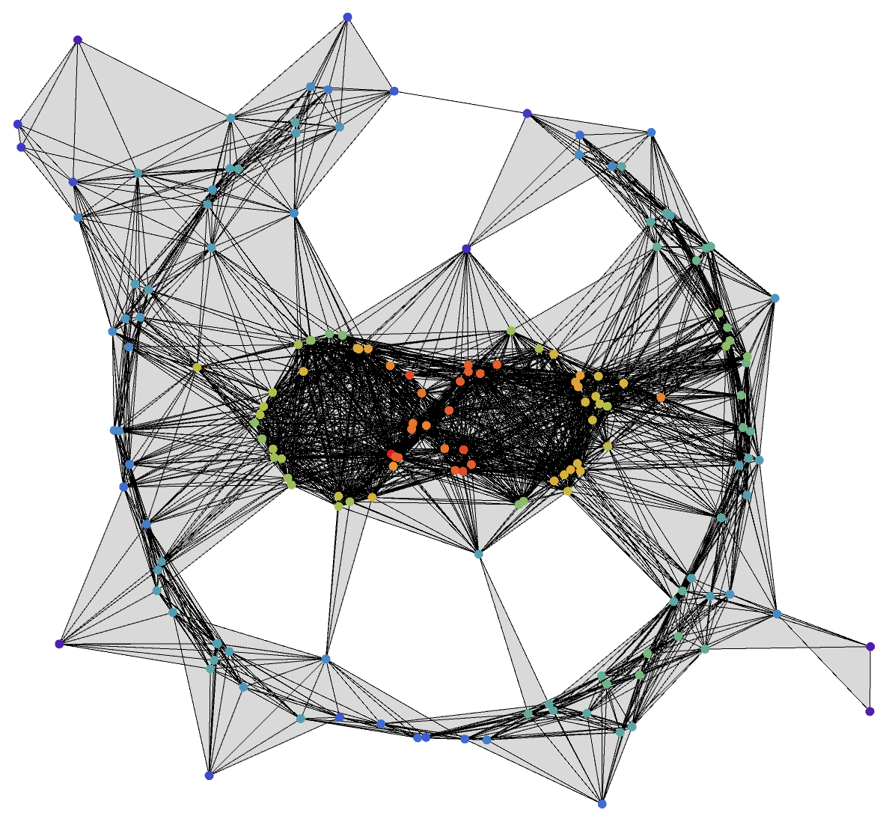

Another 2D point cloud example (Infinity Ring)
=====================================

We consider another point cloud in R2 pictured below.

   
As displayed on the illustration above, this point cloud consists of three dense cycles of points, two of which are aligned next to each other like an infinity symbol, and the third encompassing the two cycles.The diagram also has some outliers in various locations.

Once again, we will associate to this set of data a function-Rips bifiltration, taking the function on the points to be a density estimate. Note that the following diagram colors the points by density - where the red signifies the most dense area, and purple the opposite.

Input File
=====================================

An input file for RIVET for this particular set of data is provided below. This txt file is written in the format described in the 'input data' page. 

(the txt file containing data)

Like the previous example, the first four lines are parameters for RIVET: points tells RIVET that the file contains point-cloud data, 2 indicates that each point is specified by two coordinates, 4 specifies that the maximum length of edges to be constructed in the Rips filtration will be 4, and density is a text label for the horizontal axis in RIVET. The [-] preceding the axis label tells RIVET to filter by density in decreasing order, so that points with the largest density appear first in the bifiltration.

Computation from the GUI
=====================================

We proceed using the RIVET GUI. With RIVET installed, we run rivet_GUI. The input data dialog box appears. We select the data file and computation parameters, as shown below. Since we are interested in detecting a cycle, we select homology dimension 1. We must also set parameters for the coarseness of the computation, via the bins selectors. These tell RIVET to round the computed values for density and distance to a specified number of equally-spaced values, which speeds up the computation. We will choose 100 bins in each direction.

(Note that setting the bin selectors to zero will cause RIVET not to round the computed values, is more computationally expensive.)

We click Compute, and RIVET computes the augmented arrangement. This may take several minutes, depending on the computing power available.

Visualization
=====================================

When the Hilbert function and bigraded Betti numbers have been computed, visualizations of these appear in the Line Selection Window on the left side of the RIVET window (see the The RIVET Visualization page for more details). When the computation of the augmented arrangement is complete, a barcode appears in the Line Selection Window and a persistence diagram appears in the Persistence Diagram window in RIVET, as shown below. RIVET is now ready for interactive browsing of barcodes along linear slices through the bipersistence persistence module.

Further investigations 
=====================================

Once again, to understand the RIVET visualization, we will examine the simplicial complexes corresponding to specific parameter pairs identified in the RIVET diagram.

2 Hole Persistence
------------------------------------------

We will now examine the simplicial complexes corresponding to parameter pairs near either end of the 2 long bars, indicated by labels Ⓐ and Ⓑ in the diagram below. From the 2 bars that persist through the 2 points in the diagram, we can expect to see two holes in each of the simplicial complex that are produced at each of the parameter points, and that the two holes are the same hole.

Point Ⓐ has the density value of 19 and the distance value of 1.48. Thus, we construct a Rips complex at distance scale 1.48, from of only the points with density value 19 or greater, shown in the following diagram. As expected, the simplicial complex shows two holes.

   
Likewise, point Ⓑ has the density value of 12 and the distance value of 1.9. Thus, we construct a Rips complex at distance scale 1.9, from of only the points with density value 12 or greater, shown in the following diagram. As expected, the simplicial complex shows two holes, and they are the same ones shown in the simplicial complex illustration from point A.

4 More Investigations
------------------------------------------

The following RIVET visualization diagram indicates four more points labeled Ⓒ, Ⓓ, Ⓔ and Ⓕ.

Point Ⓒ has the density value of 4 and the distance value of 1.64. Thus, a Rips complex at distance scale 1.64, from of only the points with density value of 4 or greater is constructed in the illustration. From the information one can get through hovering the mouse pointer over the gray region that point Ⓒ is located, we can know that the point lies in the gray region with dimension value of 4 - conveying the fact that we should expect (and there are) 4 holes to be shown in the simplicial complex diagram below.

.. image:: images/example_2/1.64_4_4_holes.png
   :width: 400px
   :height: 340px
   :alt: simplicial complex corresponding to point C
   :align: center
   
Point Ⓓ has the density value of 8 and the distance value of 1.64 and lies on the gray region with dimension value of 3. As expected, we see 3 holes in the visualization below.

Note that one might naturally assume that the three dense cycles of point clouds would be the two circles making up the 'infinity sign' and the large circle encompassing the two adjacent circles. However we can see from the diagram above that rather the large circle encompassing the two smaller cycles is not completed but instead the third cycle is the smaller circle situated on the top left side of the diagram. 

Point Ⓔ has the density value of 2, the distance value of 2.85 and lies on the gray region with dimension value of 5. As expected, we see 5 holes in the image below.

Jason_:: I'm not sure what other example to include - all the diagrams do seem to be a repeated example.

Possible Point F?

Lastly, point Ⓕ has the density value of 4 and the distance value of 3.8 - almost the maximum values for both the density and distance value. The point lies on the gray region with dimension value of 1. As expected, we can see a single hole in the simplicial complex image below.

.. image:: images/example_2/3.8_4_1_holes.png
   :width: 400px
   :height: 340px
   :alt: simplicial complex corresponding to point F
   :align: center
