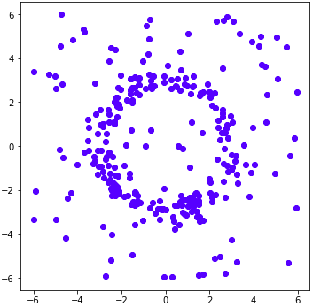
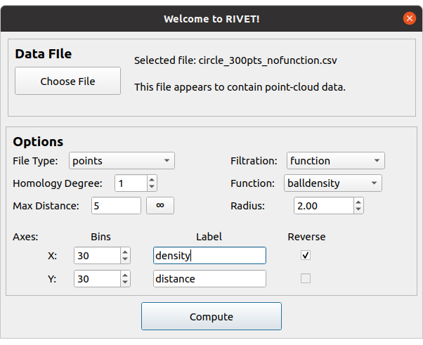
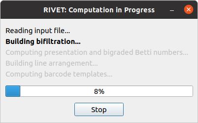
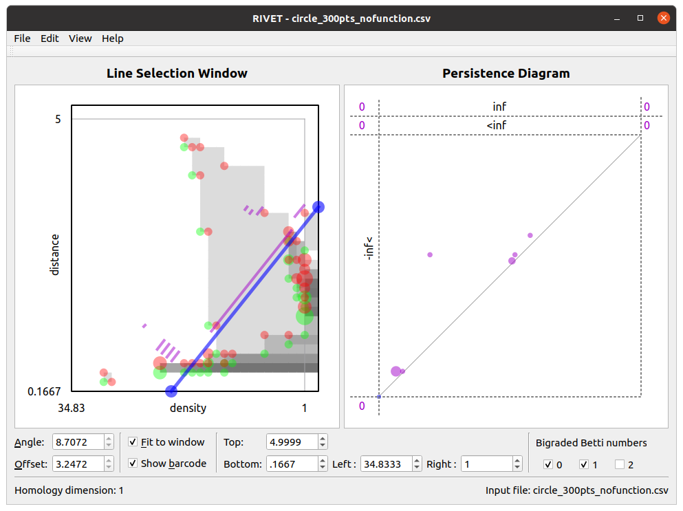

.. _gettingStarted:

Getting Started with RIVET
==========================

The RIVET software consists of two separate but closely related executables: **rivet_console**, a command-line program, and **rivet_GUI**, a GUI application.  **rivet_console** is the computational engine of RIVET; it implements the computation pipeline described in the previous section.   
**rivet_GUI** is responsible for RIVET’s visualizations and also provides a convenient graphical front-end to the functionality of **rivet_console**.  Thanks to this front-end, RIVET's visualizations can be carried out entirely from within **rivet_GUI**.  

For new users looking to acquaint themselves with RIVET, we recommend starting by using **rivet_GUI** to explore RIVET's visualization capabilities.  In this section, we provide a simple introduction to running RIVET via **rivet_GUI**.  Later sections of the documentation provide more detail on how to use **rivet_console** and **rivet_GUI**.  Users who wish to use RIVET for purposes other than visualization (e.g. machine learning or statistics applications) will want to familiarize themselves with the command-line syntax of **rivet_console**, but we recommend all users read this introduction first.

Getting started with **rivet_GUI**
----------------------------------
When the user runs **rivet_GUI**, the following window opens:

.. image:: images/file_input_dialog.png
   :width: 482px
   :height: 393px
   :alt: The file input dialog box of rivet_GUI
   :align: center

To start a computation, first select a file by clicking the *Choose File* button.    **rivet** can handle several different types of input: Point clouds, finite metric spaces, simplicial bifiltrations, and short chain complexes.  These file formats for these input types are discussed in detail in :ref:`inputData`. 

In this introduction, we consider just one simple type of input file, a CSV file specifying a point cloud in :math:`\mathbb{R}^n`. We call this type of file a *points* file. Each line of the file gives the :math:`n` coordinates of one point; these coordinates are written as numbers separated by commas or white space. 

We will use the file `data/Test_Point_Clouds/circle_300pts_nofunction.csv` from the RIVET repository. This file specifies 300 points in :math:`\mathbb{R}^2`. The first five lines of the file are as follows::

	1.57,2.40
	1.21,2.70
	0.79,-2.44
	-2.44,-2.24
	-2.54,-1.25

In this example, RIVET will compute a ball density function function on this point cloud, and construct the function-Rips bifiltration with respect to this density function.  (See :ref:`funRipsBifil` for the definitions of these terms.

The 300 points in the file `data/Test_Point_Clouds/circle_300pts_nofunction.csv` form a noisy circle in :math:`\mathbb{R}^2`, as pictured below.  The 1st persistent homology module of the function-Rips bifiltration of this data algebraic detects the presence of a "loop" in the data.  We will illustrate how RIVET visualizes this persistence module.

Upon selecting a file, RIVET activates the input selectors in the *Options* panel of the dialog box.  We now briefly discuss this panel: 

The *File Type* menu allows the user to tell RIVET what type of input file it should expect.  For this data file, we must select the default option, *points*.  

The *Homology Degree* selector allows the user to choose which degree of homology RIVET will compute. Currently, RIVET computes only a single degree of homology. A user who wishes to examine homology in multiple degrees, e.g., in degrees 0 and 1, will need to run multiple RIVET computations on the same input data. Since we want to discern a "loop" in the data, in this example we select homology degree 1.

The *Max Distance* selector allows the user to specify the maximum length of edges that RIVET will include in the simplicial complex that it constructs from the input data. This controls the size of the bifiltration, allowing the RIVET computation to run faster and with less memory. Choosing an appropriate maximum distance requires knowing something about the scale of the data. We choose a max distance of 5 for our example. The max distance can be set to infinity, which includes an edge connecting every pair of points in the point cloud, by typing “inf” or clicking on the button with an infinity symbol.  The default max distance is infinity.

Three input selectors on the right side of the box determine what filtration RIVET will build from the point cloud. The *Filtration* selector contains two options: *degree* and *function*. The *degree* option builds a degree-Rips filtration, as described in :ref:`degreeRipsBifil`. Here, we choose the *function* option to build a function-Rips filtration.

The function-Rips filtration depends on the choice of a real-valued function on the point cloud, which is specified in the *Function* selector.  For the present example, we choose the *balldensity* option, which specifies the function to be a ball density function.  Other options for the function include a Gaussian density function, a coeccentricity function, and a user-defined function, which must specified in the input file; ref:`inputData`

The ball density function depends on a choice of radius parameter, which must be provided in the box below the function selector. Here, we choose a radius of 2. 

The selectors in the lower portion of the *Options* box deal with the coordinate axes. The user may specify the number of *Bins*, to be used in the coarsening the bipersistence module. The number of bins is set separately for the x-axis and the y-axis.  The number of bins controls the number of distinct grades that occur in the module, as described in :ref:`coarsening`. Thus, specifying smaller bin values will speed the RIVET computation, but will result in less precise output.  In this example, we set both bin values to 30.

Next, the user may specify the *Label* for each axis in the RIVET visualization. For a function-Rips filtration, RIVET presents the function values along the x-axis. Since we are computing a density estimator, we enter “density” for the x-axis label. We keep the default “distance” label for the y-axis.

Lastly, the *Reverse* checkboxes allow the user to reverse axis directions. For example, when using a density function, we typically want points with larger density values to enter the filtration before points with smaller density values; thus, when we select the "balldensity" function, the *Reverse* box for the x-axis is checked by default. It is not possible to reverse the distance axis for a Rips filtration, so in this example, the y-axis *Reverse* selector is unavailable.

The RIVET file input box, with all options selected as discussed above, is shown in the following figure.

We now click *Compute*. This starts the RIVET computational pipeline, as described in :ref:`structure`. A progress box appears, as shown below.

Key Features of the RIVET Visualization
---------------------------------------

When the computation finishes, RIVET displays the following visualization.
This page gives a brief overview of the visualization elements; much more detail is found in :ref:`visualization`.

The RIVET visualization contains two main windows, the *Line Selection Window* and the *Persistence Diagram Window*, shown in the screenshot below.

Line Selection Window
^^^^^^^^^^^^^^^^^^^^^

The *Line Selection Window* visualizes the Hilbert function values and the bigraded Betti numbers of a bipersistence module.  In addition, it can interactively display the barcode obtained by restricting the module to an affine line.  The viewable region is chosen as described in :ref:`visualization`, and can be adjusted using the controls at the bottom of the window.

The Hilbert function is represented via grayscale shading of the viewable region, and points in the supports of :math:`\xi_0^M`, :math:`\xi_1^M`, and :math:`\xi_2^M` are marked with translucent green, red, and yellow dots, respectively.  The area of each dot is proportional to the corresponding function value.  Hovering the mouse over a pixel in the window gives a popup box with the value of the Hilbert function or the bigraded Betti numbers at that point.

A key feature of the RIVET visualization is the ability to interactively select the line :math:`L` via the mouse and have the barcode :math:`\mathcal B(M^L)` update in real time.
The *Line Selection Window* contains a blue line :math:`L` of non-negative slope, with endpoints on the boundary of the displayed region of :math:`\mathbb{R}^2`. 
RIVET displays a barcode for :math:`M^L` in the line selection window, provided the "show barcode" box is checked below. 
The intervals in the barcode for :math:`M^L` are displayed in purple, perpendicularly offset from the line :math:`L`.
Clicking and draging the blue line with the mouse changes the choice of line :math:`L`; for details, see :ref:`visualization`.
As the line moves, both the barcode in the Line Selection Window and its persistence diagram representation in the Persistence Diagram Window are updated in real time. 

Persistence Diagram Window
^^^^^^^^^^^^^^^^^^^^^^^^^^

The Persistence Diagram Window displays a persistence diagram representation of the barcode for :math:`M^L`.
The multiplicity of a point in the persistence diagram is proportional to the area of the corresponding dot. 
Additionally, hovering the mouse over a dot produces a popup that displays the multiplicity of the dot.

The bounds for the square viewable region (surrounded by dashed lines) in this window are chosen automatically. 
They depend on the bounds of the viewable region in the slice diagram window, but not on :math:`L`.  Some points in the persistence diagram may have coordinates that fall outside of the viewable region. 
These points are indicated by dots or numbers along the left and top edges of the persistence diagram.  For details, see :ref:`visualization`.

Customizing the Visualization
^^^^^^^^^^^^^^^^^^^^^^^^^^^^^^

The look of the visualization can be customized by choosing *RIVET → Preferences* on Mac, or *Edit → Configure* on Linux, and adjusting the settings there.  

