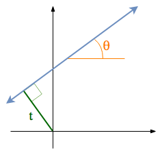

.. _rivetconsole:

Running RIVET from the Console
==============================

Recall from the :ref:`gettingStarted` page that RIVET can be run from the console via the executable **rivet_console**.  This executable has three main functions: 

* Given an *input data file* in one of the formats described in the :ref:`inputData` section of this documentation, **rivet_console** can compute a file called the *module invariants (MI) file*.  The MI file stores the Hilbert function, bigraded Betti numbers, and augmented arrangement of a persistent homology module of the input data.  The MI file is used by the RIVET visualization, and also for the following:

* Given an MI file of a bipersistence module :math:`M` and a second file, the *line file*, specifying a list of lines, **rivet_console** prints the barcodes of the 1-D slices of each line to the console.  The computations are performed using fast queries of the augmented arrangement of :math:`M`.

* Given an *input data file* as input, **rivet_console** can print a minimal presentation of a persistent homology module of the input data.  It can also print the Hilbert function and Bigraded Betti numbers.

In version 1.1 of RIVET, the syntax for running **rivet_console** and the format requirements for input files have been redesigned to be more flexible and user-friendly.  **rivet_GUI**'s interface for computing MI files has also been updated accordingly.  However,  **rivet_console** is backwards-compatible with older input files.

In what follows, we explain in more detail how to use **rivet_console**.  The syntax for running  **rivet_console** is also described in the executable's help information, which can be accessed via the command::

	rivet_console (-h | --help)
	
The help file also describes some additional technical functionality of  **rivet_console** that we will not discuss here. 

Computing a Module Invariants File
^^^^^^^^^^^^^^^^^^^^^^^^^^^^^^^^^^^^^^^^^^^^^^^^^^^^^^^^
Here the basic syntax for computing a module invariants file::

	 rivet_console <input> <output> [options]

* :code:`<input>` is an input data file;
* :code:`<output>` is the name of the module invariants file to be computed.
* :code:`[options]` are command-line flags control the computation, as specified below.

For example, a typical call to **rivet_console** to compute an MI file *MI_output.rivet* from an input file *my_data.txt* might look as follows::

	 rivet_console input.txt output.rivet --datatype metric --homology 1 --xbins 100 --ybins 100

* :code:`--datatype metric` tells RIVET that input_data.txt contains a distance matrix (specifying a finite metric space).
* :code:`--homology 1` tells RIVET to consider persistent homology in degree 1.
* :code:`--xbins 100` and :code:`--ybins 100` tell RIVET to compute a coarsened version of the homology module such that the support of the 0th and 1st Betti numbers lies on a 100x100 grid in :math:`\mathbb R^2`.  (This is done for the sake of computational efficiency.)  

When called in this way, **rivet_console** constructs the degree-Rips bifiltration of the metric space.

.. _flags:

Command-Line Flags for Use with Input Data Files
^^^^^^^^^^^^^^^^^^^^^^^^^^^^^^^^^^^^^^^^^^^^^^^^^^^^^^^^
We now explain in detail **rivet_console**'s use of command-line flags to control computations taking an *input data file* as input.  

Some or all of the command-line flags can be placed in the input data file itself, rather than given on the command line. Flags in the input data file must be provided in the top lines of the file, before the data is given.  If the same flag is given in both the input data file and the command line, then **rivet_console** ignores the copy of the flag in the input file and uses the flag given on the command line.

Whether on the command line or in an input file, flags can appear in any order.

The most important flags are the following:

* :code:`--datatype <type>` specifies the type of data contained in the input file. The default is :code:`points`.  For details, see :ref:`inputData`.

* :code:`-H <hom_degree>` or :code:`--homology <hom_degree>` specifies degree of homology to compute. If unspecified, the default value is zero.  (RIVET handles only one homology degree at a time.)

* :code:`-x <xbins>` and :code:`-y <ybins>` specify the dimensions of the grid used for coarsening. The grid spacing is taken to be uniform in each dimension. (For details on grids and coarsening, see :ref:`coarsening`.) If unspecified, each flag takes a default value of 0, which means that no coarsening is done at all in that coordinate direction. However, to control the size of the augmented arrangement, most computations of a MI file should use some coarsening of the module. These flags can also be specified in the longer forms :code:`--xbins <xbins>`. and :code:`--ybins <ybins>`.

* :code:`--bifil <type>` specifies the type of bifiltration to be built.  Specifying a bifiltration type only makes sense for certain input data types, and hence this flag can only be used for such input.  In cases where the flag can be used, the available bifiltration types are :code:`function` and :code:`degree`.  The default depends on the choice of input data type.  For details, see the :ref:`inputData` section of this documentation. 

* :code:`--function <fn>` tells RIVET to construct a function-Rips bifiltration using the function :code:`<fn>`.  RIVET supports both user-specified functions and three built-in function types.  The options for :code:`<fn>` are as follows (see :ref:`funRipsBifil` for definitions). The built-in functions each depend on a parameter, which is specified in square brackets. The square brackets are required, even if the user chooses not to specify the parameter value, in which case RIVET uses a default parameter value. (The user is encouraged to view the empty square brackets as a reminder that they are voluntarily choosing to use the default parameter value.) The supported functions :code:`<fn>` are:

	+ :code:`balldensity[r]`, where :code:`r` is a positive decimal number, for a closed-ball density function with radius parameter :code:`r`. If :code:`balldensity[]` is entered, the default value of :code:`r` is taken to be the 20th percentile of all non-zero distances between points.  The filtration direction for this function is automatically set to be descending. 
	+ :code:`gaussian[σ]`, where :code:`σ` is a positive decimal number, for a gaussian density functor with standard deviation :math:`σ`. If :code:`gaussian[]` is entered, the default value of :code:`σ` is chosen in the same way that the default radius value for the ball density estimator is chosen.  The filtration direction is set to be descending. 
	+ :code:`eccentricity[p]`, where :code:`p` is the exponent for the eccentricity function.  If :code:`eccentricity[]` is entered, the default value of :code:`p` is 1.  The filtration direction is set to be descending. 
	+ :code:`user`.  This option requires that the input data file specify a function, as explained in :ref:`inputData`.  If a function is provided in the file, the user-specified function is used by default, so it is in fact never necessary to use this flag, but it can be included for clarity's sake.  Specifying a user-defined function directly from the command line is not supported.

The following flags are also available, and are useful in many cases:

* :code:`--maxdist <distance>` specifies the maximum distance to be considered when building a vietoris-Rips bifiltration. Any edges whose length is greater than this distance will not be included in the complex.  If unspecified, this flag takes the default value of infinity.   Choosing a small value for <distance> reduces the amount of memory required for the computation, relative to the default.

* When computing an MI file, :code:`--xlabel <label>` and :code:`--ylabel <label>` respectively specify labels for the :math:`x`-axis and :math:`y`-axis in the **rivet_GUI** visualization window.  The labels are stored as metadata in the MI file.  If either of these flags are not given, RIVET provides default labels, which depend on the input data type and (where applicable), the type of bifiltration being constructed.  For example, when constructing a degree-Rips filtration, the default labels for the :math:`x`-axis and :math:`y`-axis are **degree** and **distance**, respectively.

* :code:`--xreverse` and :code:`--yreverse` reverse the direction of the :math:`x`-axis and :math:`y`-axis, respectively.  Reversing an axis direction only makes sense for certain bifiltration constructions, and hence these flags can only be used in certain circumstances.  For example, for a function-Rips filtration, the :math:`x`-axis indexes the function threshold parameter in RIVET's visualization, while the `y`-axis indexes the scale parameter.  In general, it makes equal sense to construct a function-Rips bilftration with respect to increasing or decreasing function values; the flag :code:`--xreverse` tells RIVET to use decreasing values.  But we don't have a good way of building a function-Rips bifiltration using a decreasing scale parameter, so :code:`--yreverse` is not available for the construction of a function-Rips bifiltration;  including this flag has no effect.  See :ref:`inputData` for the specifics of when and how `--xreverse` and `--yreverse` can be used.

Some additional flags which concern the internals of RIVET's computations are also available, but can be disregarded by most users:

* :code:`--num_threads <num_threads>` This flag specifies the maximum number of threads to use for parallel computation. The default value is 0, which lets OpenMP decide how many threads to use.
* :code:`-V <verbosity>` or :code:`--verbosity <verbosity>` This flag controls the amount of text that rivet_console prints to the terminal window. The verbosity may be specified as an integer between 0 and 10: greater values produce more output. A value of 0 results in minimal output, a value of 10 produces extensive output.
* :code:`-k` or :code:`--koszul` This flag causes RIVET to use a koszul homology-based algorithm to compute the Betti numbers, instead of the default approach based on computing a minimal presentation.

Computing Barcodes of 1-D Slices
^^^^^^^^^^^^^^^^^^^^^^^^^^^^^^^^^^^^^^^^^^^^^^^^^^^^^^^^^^^^^^^^^^^^^^^^^^^^^^^^^^^^^^^^^^^^^^
Here is the basic syntax for computing the barcodes of 1-D slices of a bipersistence module, given an MI file as input::

	 rivet_console <module_invariants_file> --barcodes <line_file>

:code:`<line_file>` is a file specifying a list of affine lines in :math:`\mathbb R^2` with non-negative slope.  Each line is specified by its *angle* and *offset* parameters.
The following diagram shows these parameters for a particular line, with *angle* denoted :math:`\theta` and *offset* denoted :math:`t`.

As the diagram indicates, :math:`\theta` is the angle between the line and the horizontal axis in degrees (0 to 90). 
The offset parameter :math:`t` is the *signed* distance from the line to the origin, which is positive if the line passes above/left of the origin and negative otherwise. 
This choice of parameters makes it possible to specify any line of nonnegative slope, including vertical lines. 

The following gives a sample line file::

	#A line that starts with a # character will be ignored, as will blank lines
	23 -0.22
	67 1.88
	10 0.92
	#100 0.92   <-- will error if uncommented, 100 > 90
	
For each line specified in :code:`<line_file>`, **rivet_console** will print barcode information as a single line of text, beginning by repeating the query parameters. For example, output corresponding to the sample line file above might be::

	23 -0.22: 88.1838 inf x1, 88.1838 91.2549 x5, 88.1838 89.7194 x12
	67 0.88: 23.3613 inf x1
	10 0.92: 11.9947 inf x1, 11.9947 19.9461 x2, 11.9947 16.4909 x1, 11.9947 13.0357 x4

The barcodes are given with respect to an isometric parameterization of the query line that takes zero to be the intersection of the query line with the nonnegative portions of the coordinate axes; there is a unique such intersection point except if the query line is one of the coordinate axes, in which case we take zero to be origin.

Furthermore, barcodes are returned as multisets of intervals. 
For example, in the sample output above, ``88.1838 inf x1`` indicates a single interval :math:`[88.1838, \infty)`.

Printing a Minimal Presentation
^^^^^^^^^^^^^^^^^^^^^^^^^^^^^^^^^^^^^^^^^^^^^^^^^^^^^^^^^^^^^^^^^^^^^^^^^^^^^^^^^^^^^^^^^^^^^
The basic syntax for computing and printing minimal presentation of a bipersistence module is the following::

	rivet_console <input_file> --minpres [command-line flags]

* :code:`<input>` is an input data file;
* :code:`[command-line flags]` work as specified in :ref:`flags`.

The following example shows the output format for the minimal presentation::

	x-grades
	3
	7/2
	4

	y-grades
	0
	1
	2

	MINIMAL PRESENTATION:
	Number of rows:2
	Row bigrades:
	| (1,0) (0,1) |
	Number of columns:3
	Column bigrades:
	| (1,1) (2,1) (1,2) |
	0 1 
	1 
	0 
  
The first few lines give lists of possible x- and y-grades of generators and relations in the presentation.  (NOTE: With the current code, these lists may not be minimal; we plan to change this soon.) 

The next lines specify the bigrades of the generators and relations, via indices for the lists of x- and y-grades.  Lists are indexed from 0.  Thus, in this example, the row bigrades specified are (7/2,0) and (3,1).

The final three lines specify columns of the matrix in sparse format.  Rows are indexed from 0.  Hence, the matrix specified is::

	1 0 1 
	1 1 0

Printing Hilbert Function and Bigraded Betti Numbers
^^^^^^^^^^^^^^^^^^^^^^^^^^^^^^^^^^^^^^^^^^^^^^^^^^^^^^^^^^^^^^^^^^^^^^
Here is the basic syntax for computing both the Hilbert function and bigraded Betti numbers of a bipersistence module::

	rivet_console <input_file> --betti [command-line flags]

As above,

* :code:`<input>` is an input data file;
* :code:`[command-line flags]` work as specified in :ref:`flags`.

**NOTE**: Currently, one cannot print the Hilbert function and bigraded Betti numbers of a module separately.  Nor can one print the minimal presentation, Betti numbers, and Hilbert Function together.  This will change soon.

The following shows the output format for the Hilbert function and bigraded Betti numbers, for the minimal presentation in the example above::

	x-grades
	3
	7/2
	4

	y-grades
	0
	1
	2

	Dimensions > 0:

	(0, 1, 1)
	(0, 2, 1)

	(1, 0, 1)
	(1, 1, 1)
	(1, 1, 1)
	
	(2, 0, 1)

	Betti numbers:
	xi_0:
	(1, 0, 1)
	(0, 1, 1)
	xi_1:
	(1, 1, 1)
	(1, 2, 1)
	(2, 1, 1)
	xi_2:
	(2, 2, 1)

The first few lines give lists of possible x- and y-grades of non-zero Betti numbers.  This defines a finite grid :math:`G\in \mathbb R^2`. 

The next few lines specify the points in :math:`G` where the Hilbert function is non-zero, together with the value of the Hilbert function at each point.  For each such point, a triple (x-index, y-index, value) is printed.  (Note that this information in fact determines the Hilbert function at all points in :math:`\mathbb R^2`.) 

The remaining lines specify the points where the Betti numbers are non-zero, along with the value of the Betti number at that point.  (0th, 1st, and 2nd Betti numbers are handled separately.)  Again, for each such point, a triple (x-index, y-index, value) is printed.   

