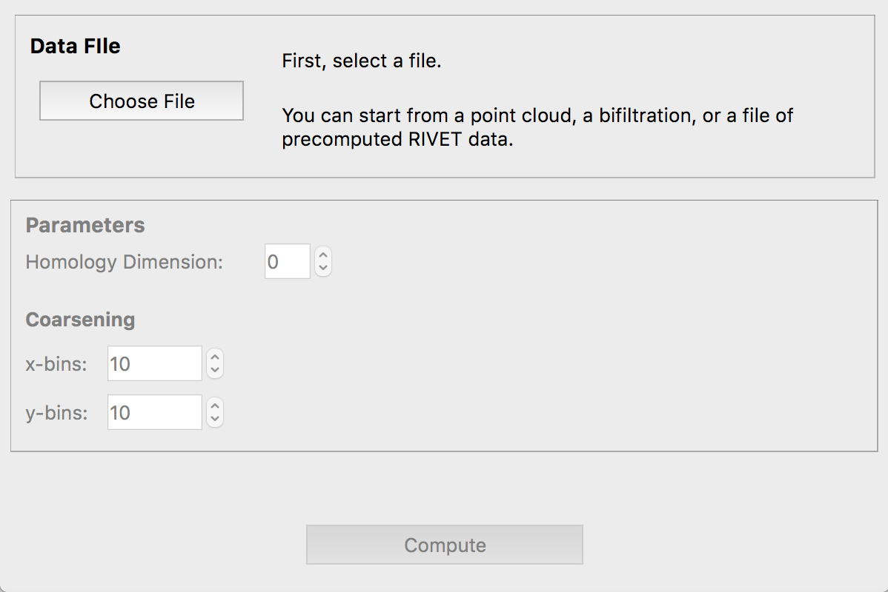

.. _runningRIVET:

Running RIVET
=============

The RIVET software consists of two separate but closely related executables: **rivet_console**, a command-line program, and **rivet_GUI**, a GUI application.  **rivet_console** is the computational engine of RIVET; it implements the computation pipeline described in the previous section.  **rivet_GUI** is responsible for RIVET’s visualizations.  

**rivet_console**
--------------------------

**rivet_console** has three main functions: 

* Given an *input data file* in one of the formats described in the :ref:`inputData` section of this documentation, **rivet_console** can compute a file called the *module invariants (MI) file*.  The MI file stores the Hilbert function, bigraded Betti numbers, and augmented arrangment of a persistent homology module of the input data.  The MI file is used by the RIVET visualization, and also for the following:

* Given an MI file of a bipersistence module \\(M\\) and a second file, the *line file*, specifying a list of lines, **rivet_console** prints the barcodes of the 1-D slices of each line to the console.  The computations are performed using fast queries of the augmented arrangment of \\(M\\).

* Given a *raw data* file as input, **rivet_console** can print The Hilbert function and Bigraded Betti numbers of a persistent homology module of the input data.  It can also print a minimal presentation of the module.

In what follows we explain in more detail how to use **rivet_console**.  The syntax for running  **rivet_console** is also described in the executable's help information, which can be accessed via the command::

	rivet_console (-h | --help)
	
The help file also describes some additional technical functionality of  **rivet_console** that we will not discuss here. 

Computation of a Module Invariants File
^^^^^^^^^^^^^^^^^^^^^^^^^^^^^^^^^^^^^^^^^^^^^^^^^^^^^^^^
Here the basic syntax for computing a module invariants file::

	 rivet_console <input> <output> [-H <dimension>] [-x <xbins>] [-y <ybins>]

* <input> is an input data file;
* <output> is the name of the module invariants file to be computed.
* [-H <dimension>] is the dimension of homology to compute [default: 0, ignored if the input file is of firep type]
* [-x <xbins>] and [-y <ybins>] specifies the dimension of a grid used for coarsening.  The grid spacing is taken to be uniform in each dimension.  A value of 0 means no coarsening is done at all in that coordinate direction.  This is the default.  However, to control the size of the augmented arrangment, most computations of a MIF should use some coarsening of the module.

Other (technical) command line options for computation of a MI file are given in the **rivet_console** help.

Computing Barcodes of 1-D Slices
^^^^^^^^^^^^^^^^^^^^^^^^^^^^^^^^^^^^^^^^^^^^^^^^^^^^^^^^^^^^^^^^^^^^^^^^^^^^^^^^^^^^^^^^^^^^^^
Here is the basic syntax for computing the barcodes of 1-D slices of a bipersistence module, given an MI file as input::

	 rivet_console <module_invariants_file> --barcodes <line_file>

<line_file> is a file specifying a list of affine lines in \\(\\mathbb R^2\\) with non-negative slope.  Each line is specified by its *angle* and *offset* parameters.
The following diagram shows these parameters for a particular line, with *angle* denoted \\(\\theta\\) and *offset* denoted \\(t\\).

.. image:: images/line_diagram.png
   :width: 237px
   :height: 226px
   :alt: Diagram illustrating angle and offset used in RIVET
   :align: center

As the diagram indicates, \\(\\theta\\) is the angle between the line and the horizontal axis in degrees (0 to 90). 
The offset parameter \\(t\\) is the *signed* distance from the line to the origin, which is positive if the line passes above/left of the origin and negative otherwise. 
This choice of parameters makes it possible to specify any line of nonnegative slope, including vertical lines. 

The following gives a sample line file::

	#A line that starts with a # character will be ignored, as will blank lines
	23 -0.22
	67 1.88
	10 0.92
	#100 0.92   <-- will error if uncommented, 100 > 90
	
For each line specified in <line_file>, **rivet_console** will print barcode information as a single line of text, beginning by repeating the query parameters. For example, output corresponding to the sample line file above might be::

	23 -0.22: 88.1838 inf x1, 88.1838 91.2549 x5, 88.1838 89.7194 x12
	67 0.88: 23.3613 inf x1
	10 0.92: 11.9947 inf x1, 11.9947 19.9461 x2, 11.9947 16.4909 x1, 11.9947 13.0357 x4

The barcodes are given with respect to an isometric parameterization of the query line that takes zero to be the intersection of the query line with the nonnegative portions of the coordinate axes; there is a unique such intersection point except if the query line is one of the coordinate axes, in which case we take zero to be origin.

Furthermore, barcodes are returned as multisets of intervals. 
For example, in the sample output above, ``88.1838 inf x1`` indicates a single interval \\([88.1838, \\infty)\\).

Printing a Minimal Presentation
^^^^^^^^^^^^^^^^^^^^^^^^^^^^^^^^^^^^^^^^^^^^^^^^^^^^^^^^^^^^^^^^^^^^^^^^^^^^^^^^^^^^^^^^^^^^^
The basic syntax for computing a minimal presentation of a bipersistence module is the following::

	rivet_console <input_file> --minpres [-H <dimension>] [-x <xbins>] [-y <ybins>]

* <input> is an input data file;
* The options for choosing homology dimensions and coarsening parameters behave exactly as for the computation of the MI file.

The following example shows the output format for the minimal presentation::

	x-grades
	3
	7/2
	4

	y-grades
	0
	1
	2

	MINIMAL PRESENTATION:
	Number of rows:2
	Row bigrades:
	| (1,0) (0,1) |
	Number of columns:3
	Column bigrades:
	| (1,1) (2,1) (1,2) |
	0 1 
	1 
	0 
  
The first few lines give lists of possible x- and y-grades of generators and relations in the presentation.  (NOTE: With the current code, these lists may not be minimal; we plan to change this soon.) 

The next lines specify the bigrades of the generators and relations, via indices for the lists of x- and y-grades.  Lists are indexed from 0.  Thus, in this example, the row bigrades specified are (7/2,0) and (3,1).

The final three lines specify columns of the matrix in sparse format.  Rows are indexed from 0.  Hence, the matrix specified is::

	1 0 1 
	1 1 0

Printing Hilbert Function and Bigraded Betti Numbers
^^^^^^^^^^^^^^^^^^^^^^^^^^^^^^^^^^^^^^^^^^^^^^^^^^^^^^^^^^^^^^^^^^^^^^
Here is the basic syntax for computing both the Hilbert function and bigraded Betti numbers of a bipersistence module::

	rivet_console <input_file> --betti [-H <dimension>] [-x <xbins>] [-y <ybins>]

As above,

* <input> is an input data file;
* The options for choosing homology dimensions and coarsening parameters behave exactly as for the computation of the MI File.

**NOTE**: Currently, one cannot print the Hilbert function and bigraded Betti numbers of a module separately.  Nor can one print the minimal presentation, Betti numbers, and Hilbert Function together.  This will change soon.

The following shows the output format for the Hilbert function and bigraded Betti numbers, for the minimal presentation in the example above::

	x-grades
	3
	7/2
	4

	y-grades
	0
	1
	2

	Dimensions > 0:

	(0, 1, 1)
	(0, 2, 1)

	(1, 0, 1)
	(1, 1, 1)
	(1, 1, 1)
	
	(2, 0, 1)

	Betti numbers:
	xi_0:
	(1, 0, 1)
	(0, 1, 1)
	xi_1:
	(1, 1, 1)
	(1, 2, 1)
	(2, 1, 1)
	xi_2:
	(2, 2, 1)

The first few lines give lists of possible x- and y-grades of non-zero Betti numbers.  This defines a finite grid \\(G\\in \\mathbb R^2\\). 

The next few lines specify the points in \\(G\\) where the Hilbert function is non-zero, together with the value of the Hilbert function at each point.  For each such point, a triple (x-index, y-index, value) is printed.  (Note that this information in fact determines the Hilbert function at all points in \\(\\mathbb R^2\\).) 

The remaining lines specify the points where the Betti numbers are non-zero, along with the value of the Betti number at that point.  (0th, 1st, and 2nd Betti numbers are handled separately.)  Again, for each such point, a triple (x-index, y-index, value) is printed.   

**rivet_GUI**
----------------------------
  
The visualizations performed by **rivet_GUI** require an MI file as input.  This can be computed by an explicit call to **rivet_console** and then opened in **rivet_GUI**.  Alternatively, **rivet_GUI** can call **rivet_console** directly to compute the MI file.

When the user runs **rivet_GUI**, a window opens which allows the user to select a file.
This file can be either an input data file in one of the input formats described in the :ref:`inputData` section of this documentation, or a MI file.

If an input data file is selected, then (unless the file is of type firep) the user must choose the homology degree: RIVET currently handles one homology degree at a time.  The x-bins and y-bins parameters for the call to **rivet_console** must also be seleced.  After the user clicks the compute button, the MI file is computed via a call to **rivet_console** and the visualization is started.  (Note that once the Hilbert Function and Betti numbers are shown in the visualization, it may take a significant amount of additional time to prepare the interactive visualization of the barcodes of 1-D slices.)
Using the file menu in the GUI, the user may save an MI file.

If an MI file is selected in the file dialogue window, the data in the file is loaded immediately into the RIVET visualization, and the visualization begins. 

The RIVET visualization itself is explained in the section ":ref:`visualization`".
