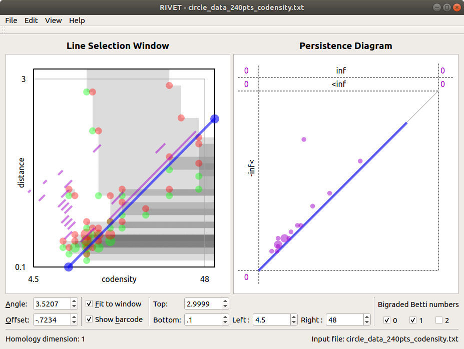

.. _visualization:

The RIVET Visualization
=======================

.. For more details, see `the RIVET paper <a href="https://arxiv.org/pdf/1512.00180v1.pdf>`_.

The RIVET interface contains two main windows, the *Line Selection Window* and the *Persistence Diagram Window*, shown in the screenshot below.

Line Selection Window
---------------------

By default, the *Line Selection Window* plots a rectangle in \\(\\mathbb{R}^2\\) containing the union of the supports of bigraded Betti number functions \\(\\xi_i^M\\), \\(i\\in \\{0,1,2\\}\\).
(If the input to RIVET is an firep and the Betti numbers are not supported on a horizontal or vertical line, this will be the smallest such rectangle.  If the input is a point cloud, metric space, or bifiltration, and the birth indices of all simplices in the bifiltration do not lie on a single line, the rectangle will be the smallest one containing the birth indices of all simplices.)
 
Points in the supports of \\(\\xi_0^M\\), \\(\\xi_1^M\\), and \\(\\xi_2^M\\) are marked with green, red, and yellow dots, respectively (though these colors are customizable via the Edit menu on Linux or the Preferences menu on Mac). 
The area of each dot is proportional to the corresponding function value. 
The dots are translucent, so that, for example, overlaid red and green dots appear brown on their intersection. 
This allows the user to read the values of the Betti numbers at points which are in the support of more than one of the functions. 
Furthermore, hovering the mouse over a dot produces a popup box that gives the values of the bigraded Betti numbers at that point.

The greyscale shading at a point \\(a\\) in this rectangle represents \\(\\dim M_a\\): \\(a\\) is unshaded when \\(\\dim M_a=0\\), and larger \\(\\dim M_a\\) corresponds to darker shading. 
Hovering the mouse over \\(a\\) brings up a popup box which gives the precise value of \\(\\dim M_a\\).

A key feature of the RIVET visualization is the ability to interactively select the line \\(L\\) via the mouse and have the barcode \\(\\mathcal B(M^L)\\) update in real time.
The Line Selection Window contains a blue line \\(L\\) of non-negative slope, with endpoints on the boundary of the displayed region of \\(\\mathbb{R}^2\\). 
RIVET displays a barcode for \\(M^L\\) in the line selection window, provided the "show barcode" box is checked below. 
The intervals in the barcode for \\(M^L\\) are displayed in purple, perpendicularly offset from the line \\(L\\).

The user can click and drag the blue line with the mouse to change the choice of line \\(L\\).
Clicking and dragging an endpoint of the line moves that endpoint while keeping the other fixed. 
One endpoint is locked to the top and right sides of the displayed rectangle; the other endpoint is locked to the bottom and left sides.
Clicking and dragging the interior of the line (away from its endpoints) moves the line as follows:

* Left-clicking moves the line in the direction perpendicular to its slope, keeping the slope constant.
* Right-clicking changes the slope of the line, while keeping the bottom/left endpoint fixed.

As the line moves, both the barcode in the Line Selection Window and its persistence diagram representation in the Persistence Diagram Window are updated in real time. 
The *Angle* and *Offset* controls below the Line Selection Window can also be used to select the line.

The coordinate bounds of the viewable rectangle may be adjusted using the *Top*, *Bottom*, *Left*, and *Right* control boxes at the bottom of the RIVET window.
The window can be reset to the default by clicking on “Restore Default Window,” under the “View” menu.  Clicking on “Betti number window” under the “View” menu sets the window to the smallest rectangle containing all non-zero Betti numbers.

Persistence Diagram Window
--------------------------

The Persistence Diagram Window (at right in the screenshot above) displays a persistence diagram representation of the barcode for \\(M^L\\).

The bounds for the square viewable region (surrounded by dashed lines) in this window are chosen automatically.  They depend  on the bounds of the viewable region in the slice diagram window, but not on \\(L\\).

Let the square \\([0,B]\\times[0,B]\\) be the viewable region.  It may be that the barcode contains some intervals \\([\\alpha,\\beta)\\) with either \\(\\alpha\\) or \\(\\beta\\) not contained in \\([0,B]\\).  To represent such intervals on the screen, RIVET displays some information at the top and left of the persistence diagram which is not found in typical persistence diagrams.

Above the square region of persistence diagram are two narrow horizontal strips, separated by a dashed horizontal line. 
The upper strip is labeled *inf*, and the lower strip is labeled \\(\\lt\\)\ *inf*. 
RIVET plots a point in the upper strip for each interval \\([\\alpha, \\infty)\\) in the barcode with \\(0\\leq \\alpha 
\\le B\\). 
RIVET plots a point in the lower strip for each interval \\([\\alpha, \\beta)\\) in the barcode with \\(0\\leq \\alpha \\le B\\lt \\beta \\lt \\infty)\\).  

To the left of the square region of persistence diagram is a vertical strip labeled - *inf* \\(\\lt\\).  RIVET plots a point in this strip for each interval \\([\\alpha, \\beta)\\) in the barcode with \\(\\alpha \\lt 0\\leq \\beta \\leq  B)\\).  

Just to the right and to the left of each of the two upper horizontal strips is a number, separated from the strip by a dashed vertical line:  

* To the upper right is the number of intervals \\([\\alpha, \\infty)\\) in the barcode with \\(B \\lt \\alpha\\). 
* To the lower right is the the number of intervals \\([\\alpha, \\beta)\\) with \\(B \\lt \\alpha\\) and \\(\\beta \\lt \\infty\\).
* To upper left is the number of intervals \\([\\alpha, \\infty)\\) with \\( \\alpha\\lt 0\\).  
* To the lower left is the number of intervals \\([\\alpha, \\beta)\\) with \\( \\alpha< 0\\) and $B\\lt\\beta \\lt\\infty\)).    
Finally, there is a number in the bottom left corner of the persistence diagram window.  This is the number of intervals \\([\\alpha, \\beta)\\) with \\( \\alpha\\lt \\beta< 0\\). 

As with the bigraded Betti numbers in the Line Selection Window, the multiplicity of a point in the persistence diagram is indicated by the area of the corresponding dot. 
Additionally, hovering the mouse over a dot produces a popup that displays the multiplicity of the dot.

Customizing the Visualization
----------------------------------------------
The look of the visualization can be customized by clicking on “Preferences” in the “RIVET” menu, and adjusting the settings there.  
